# Instalar IDE4PLC en GNU/Linux

### Por Ing. Eric Pernia.

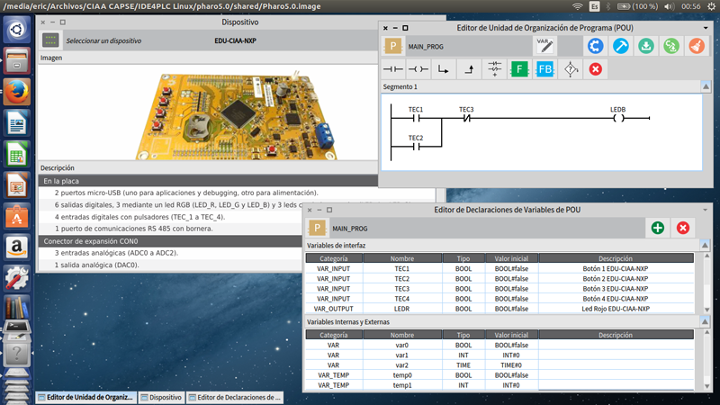

## Descargar el Pharo adecuado según la versión de Linux

Pharo es un entrono de desarrollo y ejecución de Smalltalk. Su web oficial es <http://pharo.org/>:

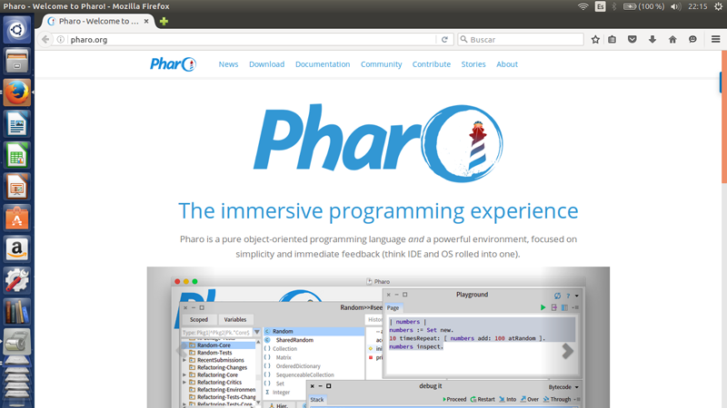

Antes de su descarga, se debe chequear la versión instalada de *libc* para descargar la versión correcta de Pharo para linux. 

Para saber la versión de *libc* abrir una terminal y ejecutar:

```
locate libc.so.6
```

Este comando retorna las rutas de *libc*, en este caso:

```
/lib/i386-linux-gnu/libc.so.6
/lib/x86_64-linux-gnu/libc.so.6
```

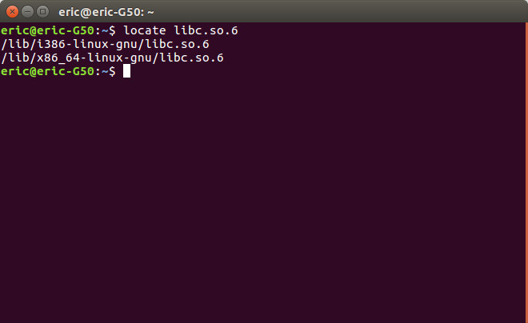

Luego ejecutar cada una de estas líneas para conocer la versión, en este caso 2.3 como se observa en las siguientes imágnes:

```
/lib/i386-linux-gnu/libc.so.6
```

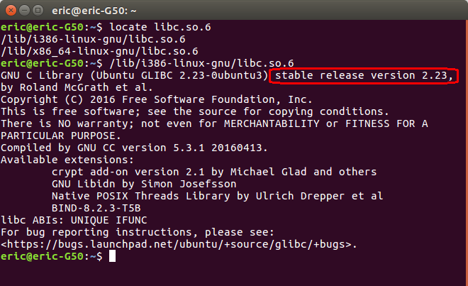

```
/lib/x86_64-linux-gnu/libc.so.6
```

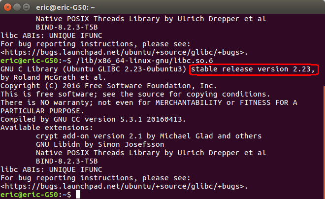

De esta manera, en este caso particular (Ubuntu 16.04) se debe bajar la versión de Pharo **Default GNU/Linux** de <http://pharo.org/gnu-linux-installation>.

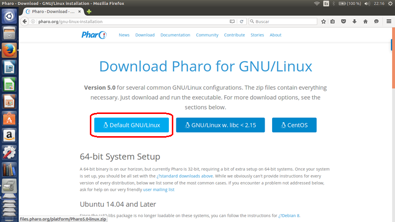

Luego de descargar el Pharo adecuado, se debe descomprimir quedandola carpeta *pharo5.0*.

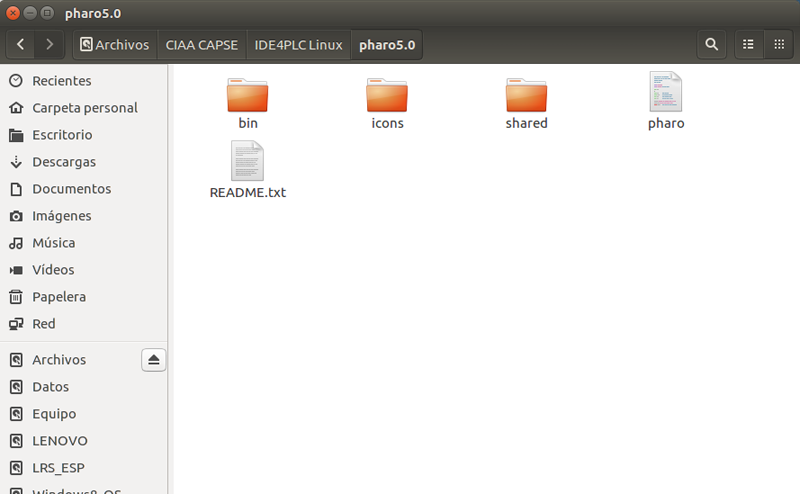

Chequear permisos de ejecución de Pharo. Verificar que el script de bash *pharo* dentro de la carpeta *IDE4PLC* tenga el permiso de ejecución.

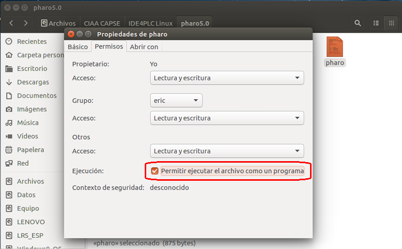

## Probar que Pharo funcione

Abrir una terminal, ir a la carpeta *IDE4PLC* y ejecutar:

```
./pharo
```

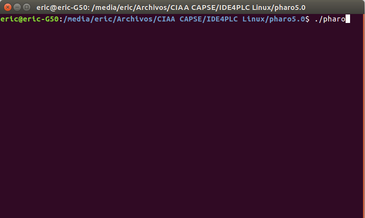

Si todo está bien debería abrirse el entorno como se muestra a continuación:

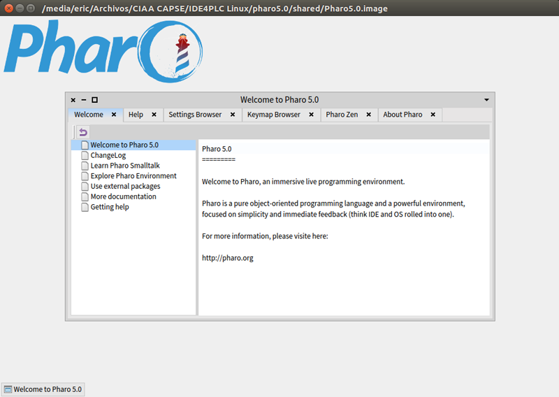

## Descargar IDE4PLC desde Github

Clonar el repositorio de github de IDE4PLC. Abrir una terminal y ejecutar:

```
git clone https://github.com/ciaa/IDE4PLC.git
```

De esta manera se descargará el repositorio.

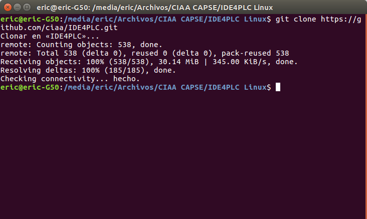

Este repositorio contiene los achivos:

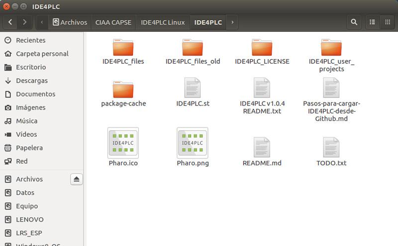

## Integrar IDE4PLC en Pharo

Copie los archivos del repositorio dentro de la carpeta:

```
pharo5.0/shared
```

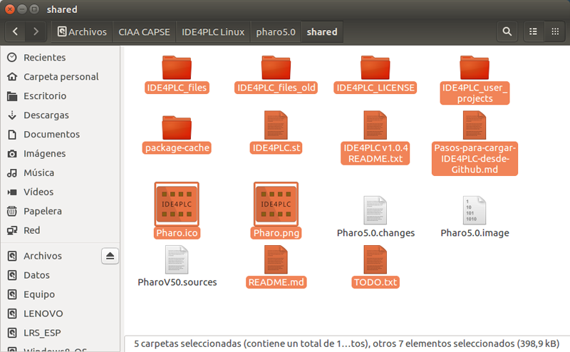

Reemplazar los íconos en la carpeta:

```
pharo5.0/icons
```

por los archivos "Pharo.ico" y "Pharo.png" del repositorio.

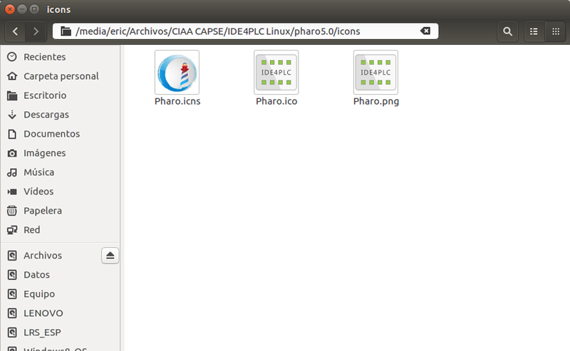

Abrir nuevamente Pharo para cargar el software IDE4PLC. Se debe cerrar la ventana titulada "Wellcome to Pharo 5.0". Presione el botón izquierdo del mouse en cualquier espacio vacío para abrir el menú **World**, elija la opción "Monticello Browser".

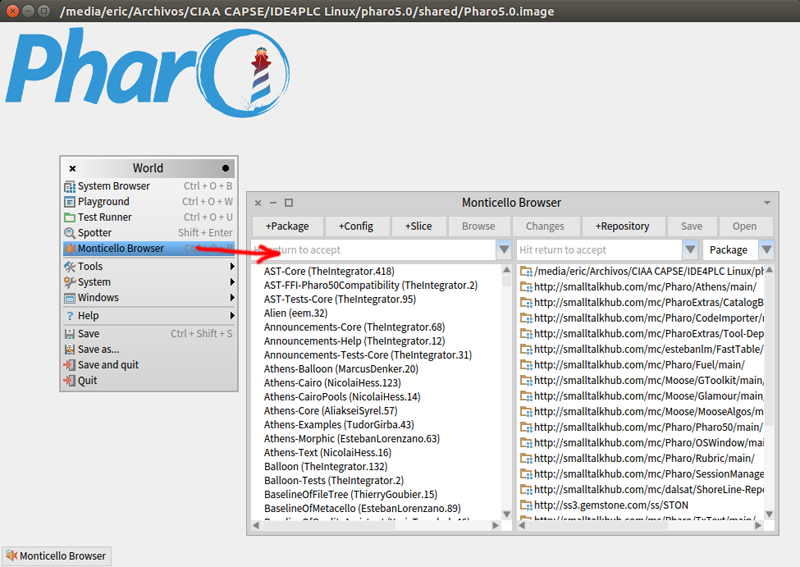

En la lista de la derecha seleccione la carpeta *package-cache* y presione el botón "Open".

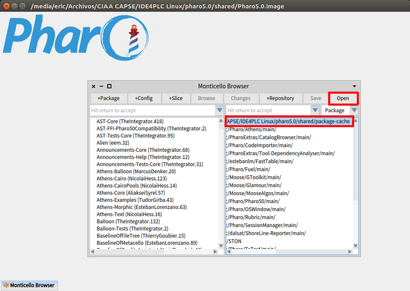

Seleccione en la nueva lista de la derecha el último package .mcz disponible de IDE4PLC, (actualmente "IDE4PLC-EricPernia.64.mcz") y presione el botón "Load". 

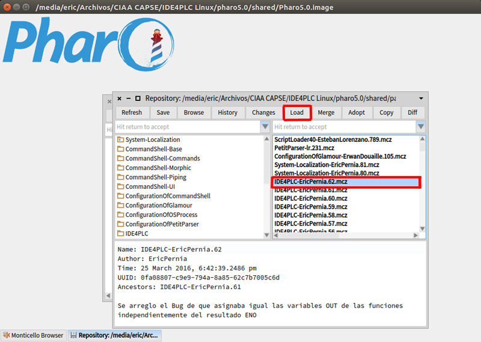

Este proceso puede tardar varios minutos ya que carga en la imagen de Pharo todo el código fuente de las clases que componen IDE4PLC y compila cada uno de sus métodos logrando que estén disponibles para su ejecución en el sistema. Espere a que termine, cuando esto suceda podra presionar en cualquier parte y verá el menú World, mientras ejecuta este paso Pharo se encontrará bloqueado y no mostrará dicho menú.

Puede comprobar la carga del *package* IDE4PLC en el "System Browser" abríendolo desde el menú wold y navegando hasta IDE4PLC como se muestra a continuación.

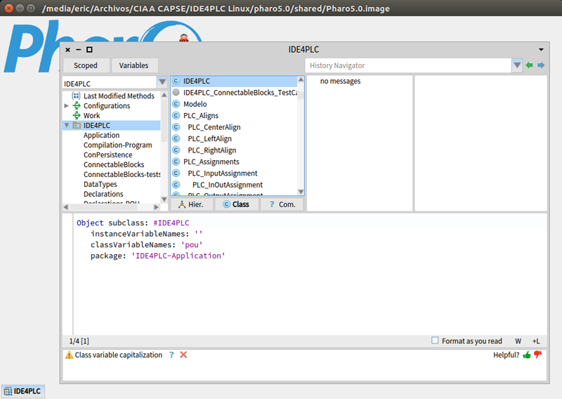

Abra el menu World, opción "Playground" para abrir una ventana donde ejecutar código smalltalk (en vesriones anteriores a Pharo 4 utilice un "Workspace" que es equivalente). 

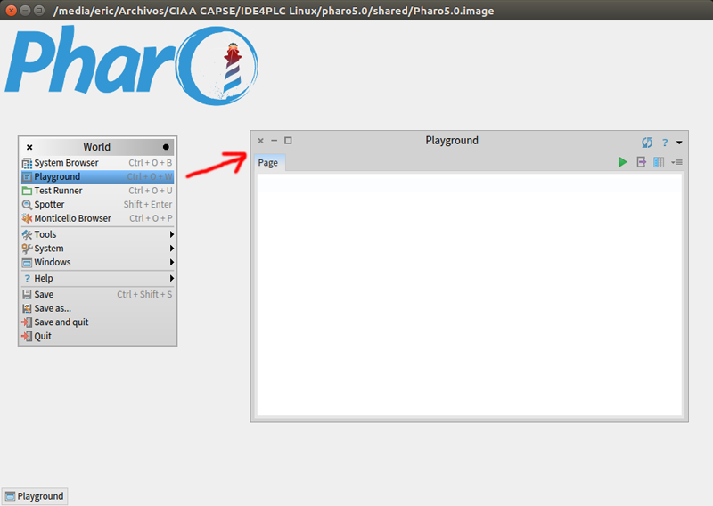

Ejecute la siguiente línea desde el Playground (seleccione la línea y presione "Ctrl + d" o mediante botón derecho y la opción "do it"):

```
IDE4PLC loadIDE4PLCDependences.
```

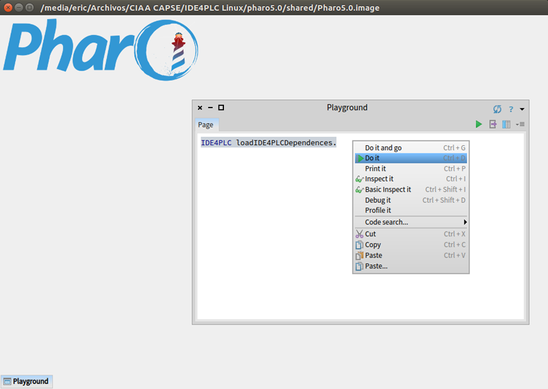

De esta manera se cargan todas las clases desarrolladas por terceros que utiliza IDE4PLC pero no vienen en la imagen estándar de Pharo. Actualmente carga en particular los package "PetitParser" y "OSProcess".

Luego ejecutar:

```
IDE4PLC initializeIDE4PLC.
```

para iniciar el software IDE4PLC.

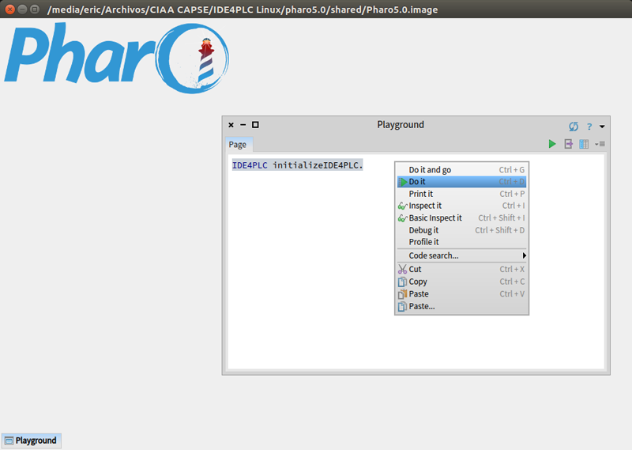

Solicitará ingresar Nombre y apellido par futuros cambios a la imagen de Pharo. Ingrese con formato "NombreApellido" sin espacios y ambos comenzando en mayúsculas.

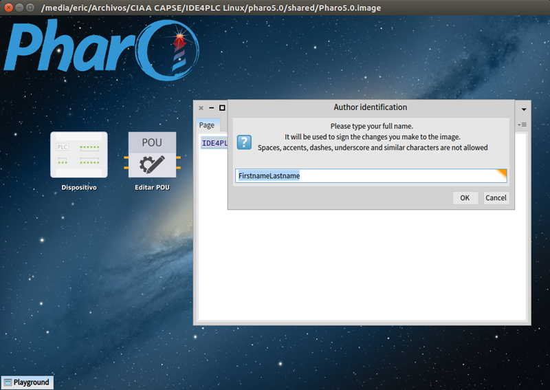

Para tener los comandos útiles e información de IDE4PLC se debe abrir un workspace para cargar los comandos básicos. En el Playground ejecutar:

```
Workspace open.
```

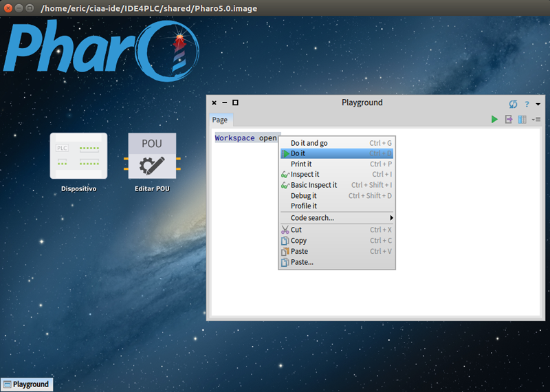

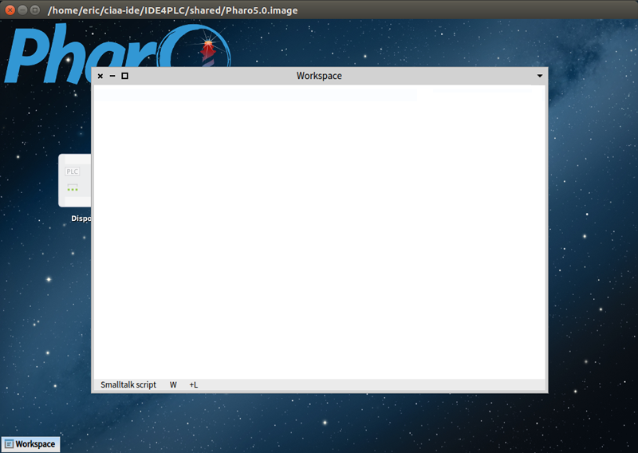

Copiar el contenido de IDE4PLC.txt ubicado en la carpeta "docs" (se abre con cualquier editor de texto) al workspace quedando:

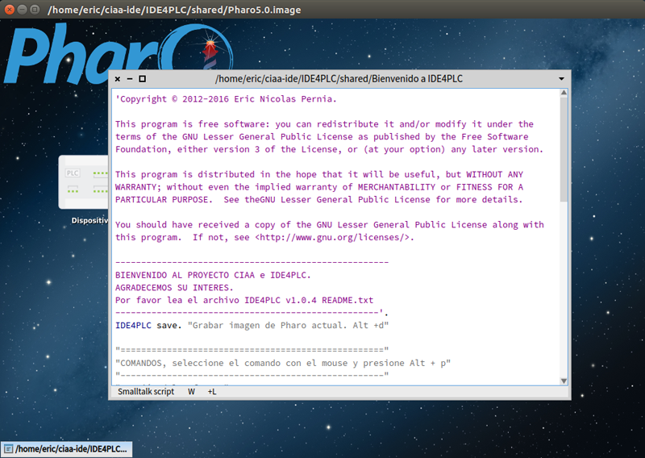

Ejecutar: 

```
IDE4PLC linux.
```

De esta manera se configurará el software con Paths y otras particularidades del Sistema Operativo.

Al realizar esta acción nótese que no podrá abrir más el menú World, esto se debe a que IDE4PLC entra en "Modo usuario" cancelando el acceso a las herramientas de desarrollo de Pharo. Esto ayuda a que usuarios inexpertos solo vean las ventanas de IDE4PLC y no las de desarrollo de Pharo.

Para volver al "Modo desarrollador" ejecutar en el Workspace:

```
IDE4PLC showDevelopTools.
```

Para grabar imagen de Pharo con todos los cambios realizados ir al menú World y elegir "Save".

**Si no se realiza este paso al cerrar Pharo se perderán tdos los cambios.**

Luego cerrar Pharo.

# Integrar IDE4PLC con el CIAA Firmware

Renombrar la carpeta de "pharo5.0" a "IDE4PLC". 

Mover esta carpeta *IDE4PLC* a la misma ruta donde esté ubicada la carpeta *Firmware* (si han seguido los path recomendados en los manuales de instalación del CIAA-Firmware, se encontrará dentro de su carpeta personal en *ciaa-ide*).

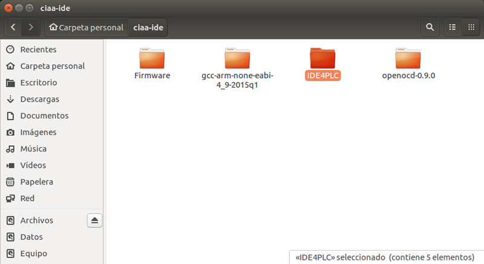

De esta manera las carpetas "IDE4PLC" y "Firmware" se encontrarán ambas en "ciaa-ide".

Este paso es necesario para que IDE4PLC pueda acceder al compilador y Firmware.


